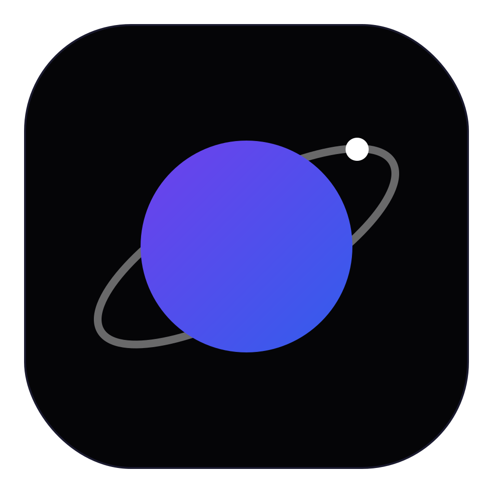

<p align="center">
  
</p>

<h1 align="center">Galactic</h1>

<p align="center">
  <strong>The command center for developers who juggle multiple projects, branches, and environments.</strong>
</p>

<p align="center">
  <a href="https://galactic-dev.com">Website</a> &middot;
  <a href="https://galactic-dev.com">Download</a> &middot;
  <a href="#features">Features</a> &middot;
  <a href="#quick-start">Quick Start</a> &middot;
  <a href="CONTRIBUTING.md">Contributing</a>
</p>

<p align="center">
  
  
  
  
  
</p>

<p align="center">
  <video src="https://galactic-dev.com/demos/hero-demo.mp4" width="720" autoplay loop muted playsinline>
    
  </video>
</p>

---

## Why Galactic?

Modern development means working across multiple repositories, branches, microservices, and AI coding agents, often at the same time. Context-switching between them is slow, error-prone, and eats into flow state.

**Galactic** gives you a single native desktop app to manage it all:

- **Launch any project** in Cursor or VS Code with one click
- **Create isolated Git worktrees** so you can work on multiple branches simultaneously without stashing
- **Run parallel environments** on the same ports using network isolation, no Docker or VMs needed
- **Monitor your AI agents** (Cursor, Claude, Codex) in real time through MCP integration
- **Jump to anything instantly** with a global hotkey launcher

---

## Features

### Project Dashboard & Git Worktrees

Create fully isolated worktrees for any branch with a single click. Each worktree gets its own `.code-workspace` file and can optionally inherit config files from the main repo. Work on a hotfix while your feature branch stays untouched.

<p align="center">
  <video src="https://galactic-dev.com/demos/clip-workspaces.mp4" width="720" autoplay loop muted playsinline></video>
</p>

### Network Isolation Environments

The standout feature. Galactic assigns unique loopback addresses (`127.0.0.2`, `127.0.0.3`, ...) to each environment, letting you run **multiple instances of the same stack on the same ports** without conflicts. No containers, no port juggling.

<p align="center">
  
</p>

<p align="center">
  <video src="https://galactic-dev.com/demos/clip-environments.mp4" width="720" autoplay loop muted playsinline></video>
</p>

### AI Agent Monitoring (MCP)

Galactic runs an [MCP](https://modelcontextprotocol.io/) server that connects to your AI-powered editors. See active agent sessions from Cursor, VS Code, Claude, and Codex in one place. Get notified when a session finishes, takes too long, or needs your attention.

<p align="center">
  <video src="https://galactic-dev.com/demos/clip-agent-monitoring.mp4" width="720" autoplay loop muted playsinline></video>
</p>

### Quick Launcher

Press **Cmd+Shift+G** anywhere on your Mac to summon a floating sidebar with all your projects, workspaces, and active agent sessions. Jump into any workspace instantly without switching to Galactic first.

<p align="center">
  
</p>

### Dual Editor Support

First-class support for both **Cursor** and **VS Code**. Choose your preferred editor globally, and Galactic handles workspace file generation, environment binding, and smart launch logic for either one.

### Workspace Environment Binding

Attach environments to projects and worktrees. Galactic writes `.code-workspace` files with your environment variables baked in, and detects when variables change so you know to relaunch.

---

## Quick Start

### Download

Grab the latest signed `.dmg` from [galactic-dev.com](https://galactic-dev.com).

### Build from Source

**Prerequisites:** macOS Sonoma or newer, Node.js >= 18, Xcode Command Line Tools

```sh
# Clone the repo
git clone https://github.com/idolaman/galactic-ide.git
cd galactic-ide

# Install dependencies
npm install

# Start in development mode
npm run dev
```

This launches Vite (renderer), the Electron main process compiler, and Electron itself concurrently. Hot reload is enabled for the renderer; Electron restarts automatically when main-process files change.

### Production Build

```sh
npm run build
```

Outputs a signed `.dmg` and `.zip` to the `release/` directory (arm64 + x64).

---

## Architecture

```
galactic-ide/
├── electron/            # Main process, preload, MCP server
│   ├── main.ts          # Electron entry point & IPC handlers
│   ├── preload.ts       # Secure bridge to renderer
│   └── mcp-server.ts    # Model Context Protocol server
├── src/                 # React renderer (Vite)
│   ├── pages/           # Top-level routes
│   ├── components/      # React components + shadcn/ui
│   ├── services/        # Business logic & IPC bridges
│   ├── hooks/           # Custom React hooks
│   ├── stores/          # Zustand state
│   └── types/           # TypeScript definitions
├── electron-builder.yml # Build & packaging config
└── package.json
```

### Tech Stack

| Layer | Technology |
|-------|-----------|
| Desktop Shell | Electron 32 |
| Frontend | React 18, TypeScript 5.8, Vite 5 |
| UI Components | shadcn/ui + Radix UI |
| Styling | Tailwind CSS 3 |
| State | Zustand, TanStack React Query |
| Validation | Zod |
| Icons | Lucide React |
| Auto-Updates | electron-updater |

---

## Scripts

| Command | Description |
|---------|-------------|
| `npm run dev` | Launch Electron + Vite in development mode |
| `npm run build` | Production macOS build (dmg + zip) |
| `npm run build:ui` | Vite production build only |
| `npm run build:main` | Compile Electron TypeScript |
| `npm run lint` | Run ESLint |

---

## Contributing

Contributions are welcome! Please read [CONTRIBUTING.md](CONTRIBUTING.md) before opening a PR.

```sh
# Fork & clone, then:
npm install
npm run dev
npm run lint   # Must pass before submitting
```

See [CLAUDE.md](CLAUDE.md) for detailed coding conventions (file size limits, styling rules, import patterns, naming, etc.).

---

## Roadmap

- [ ] Windows and Linux support
- [ ] Plugin system for custom integrations
- [ ] Project templates and scaffolding
- [ ] Team workspace sharing
- [ ] Built-in terminal with environment awareness

Have an idea? [Open an issue](../../issues) to start a discussion.

---

## License

Galactic is open-source software licensed under the [GNU Affero General Public License v3.0](LICENSE).

---

<p align="center">
  Built by <a href="https://galactic-dev.com">Galactic Dev</a>
</p>
