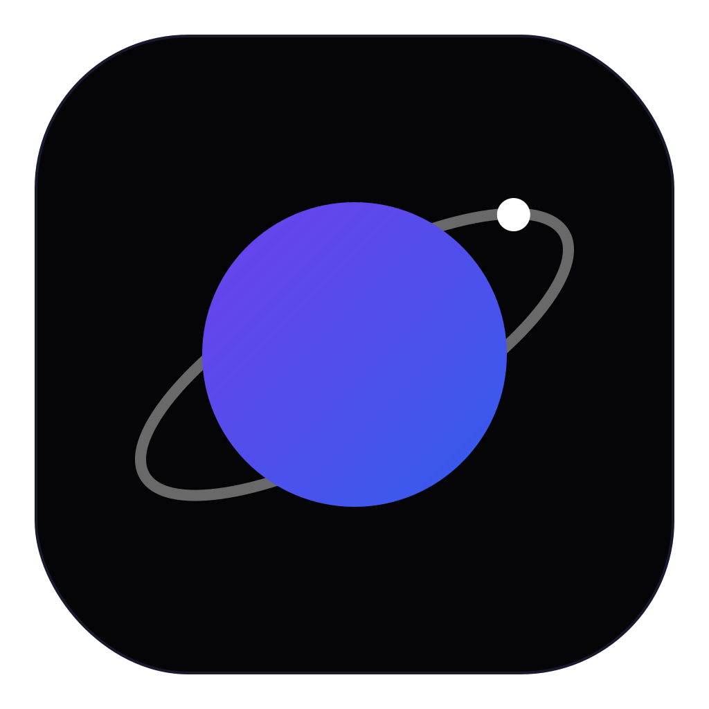

<p align="center">
  
</p>

<h1 align="center">Galactic</h1>

<p align="center">
  <strong>The desktop command center for running branch workspaces, project services, and AI agents side by side.</strong>
</p>

<p align="center">
  <a href="https://galactic-dev.com">Website</a> &middot;
  <a href="https://galactic-dev.com">Download</a> &middot;
  <a href="#features">Features</a> &middot;
  <a href="#quick-start">Quick Start</a> &middot;
  <a href="CONTRIBUTING.md">Contributing</a>
</p>

<p align="center">
  
  
  
  
  
</p>

<p align="center">
  
</p>

---

## Why Galactic?

Modern development means working across multiple repositories, branches, microservices, and AI coding agents, often at the same time. Context-switching between them is slow, error-prone, and eats into flow state.

**Galactic** gives you a single native desktop app to manage it all:

- **Run Project Services side by side** with stable local domains for every branch, app, API, worker, and dependency
- **Create isolated Git worktrees** so you can work on multiple branches simultaneously without stashing
- **Launch any project** in Cursor or VS Code with one click
- **Monitor your AI agents** (Cursor, Claude, Codex) in real time through MCP integration
- **Jump to anything instantly** with a global hotkey launcher

---

## Features

### Project Services

Galactic's main workflow is Project Services: define the services in a project once, then run the same stack across multiple branch workspaces without fighting over one shared `localhost`.

Instead of every branch trying to own `localhost:3000`, Galactic gives each service a predictable route:

```text
client.add-labels-feature.task-manager.localhost:1355
api.add-labels-feature.task-manager.localhost:1355
client.add-basic-sidebar.task-manager.localhost:1355
api.add-basic-sidebar.task-manager.localhost:1355
```

That route is service-aware, branch-aware, and project-aware. You can keep a feature branch, a hotfix branch, and the repository root running at the same time, all with the same dev commands and without containers, VMs, or manual port juggling.

<p align="center">
  
</p>

How it works:

- **Project topology:** choose single-app or monorepo mode, then map services to folders such as `.`, `apps/web`, `apps/api`, or `workers/email`.
- **Workspace activation:** when you activate Project Services for a branch worktree, Galactic applies the saved topology to that workspace and assigns runtime ports for each service.
- **Local routing:** Galactic runs a local proxy on `localhost:1355`. Requests to `service.branch.project.localhost:1355` are routed back to the correct `127.0.0.1:<port>` service for that workspace, including WebSocket traffic.
- **Terminal Auto-Env:** a managed zsh hook exports the right `HOST` and `PORT` when you `cd` into a service folder, so normal commands like `npm run dev` start on the workspace-specific port.
- **Service connections:** services can declare environment variables that point to other services, including services in another Galactic project. For example, a web app can receive `API_URL=http://api.feature-auth.shop.localhost:1355`.

Most common frameworks already respect `PORT`, including Next.js, Express, and Nuxt. Galactic handles host and port wiring for Vite, Astro, React Router, Angular, Expo, and React Native; SvelteKit is covered through Vite. The older local-IP environment mode is kept for existing setups, but Project Services is the recommended path for new parallel workspace workflows.

### Project Dashboard & Git Worktrees

Create fully isolated worktrees for any branch with a single click. Each worktree gets its own `.code-workspace` file and can optionally inherit config files from the main repo. Work on a hotfix while your feature branch stays untouched.

<p align="center">
  
</p>

### AI Agent Monitoring (MCP)

Galactic runs an [MCP](https://modelcontextprotocol.io/) server that connects to your AI-powered editors. See active agent sessions from Cursor, VS Code, Claude, and Codex in one place. Get notified when a session finishes, takes too long, or needs your attention.

<p align="center">
  
</p>

### Quick Launcher

Press **Cmd+Shift+G** anywhere on your Mac to summon a floating sidebar with all your projects, workspaces, and active agent sessions. Jump into any workspace instantly without switching to Galactic first.

<p align="center">
  
</p>

### Dual Editor Support

First-class support for both **Cursor** and **VS Code**. Choose your preferred editor globally, and Galactic handles workspace file generation, Project Services metadata, and smart launch logic for either one.

### Workspace Awareness

Keep projects, branch worktrees, routed services, and active agent sessions connected to the workspace they belong to. Galactic makes it clear which branch is running, which services are live, and which editor or agent session needs attention.

---

## Quick Start

### Download

Grab the `.dmg` from [galactic-dev.com](https://galactic-dev.com).

### Build from Source

**Prerequisites:** macOS Sonoma or newer, Node.js >= 18, Xcode Command Line Tools

```sh
# Clone the repo
git clone https://github.com/idolaman/galactic-ide.git
cd galactic-ide

# Install dependencies
npm install

# Start in development mode
npm run dev
```

This launches Vite (renderer), the Electron main process compiler, and Electron itself concurrently. Hot reload is enabled for the renderer; Electron restarts automatically when main-process files change.

### Production Build

```sh
npm run build
```

Outputs a signed `.dmg` and `.zip` to the `release/` directory (arm64 + x64).

---

## Scripts

| Command | Description |
|---------|-------------|
| `npm run dev` | Launch Electron + Vite in development mode |
| `npm run build` | Production macOS build (dmg + zip) |
| `npm run build:ui` | Vite production build only |
| `npm run build:main` | Compile Electron TypeScript |
| `npm run lint` | Run ESLint |

---

## Contributing

Contributions are welcome! Please read [CONTRIBUTING.md](CONTRIBUTING.md) before opening a PR.

```sh
# Fork & clone, then:
npm install
npm run dev
npm run lint   # Must pass before submitting
```

See [CLAUDE.md](CLAUDE.md) for detailed coding conventions (file size limits, styling rules, import patterns, naming, etc.).

Have an idea? [Open an issue](../../issues) to start a discussion.

---

## License

Galactic is open-source software licensed under the [GNU Affero General Public License v3.0](LICENSE).

---

<p align="center">
  Built by <a href="https://galactic-dev.com">Galactic Dev</a>
</p>
